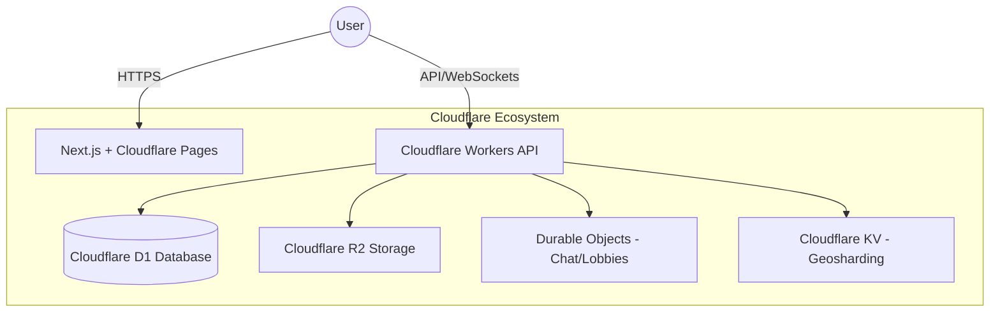

# Love Vibes Architecture

Love Vibes is built using a modern, edge-centric architecture designed for high performance, global scalability, and real-time interaction.

## System Overview

The platform is split into two main parts:
1. **Frontend**: A Next.js application providing the user interface.
2. **Backend**: A Cloudflare Workers-based API managing data, safety, and real-time features.

## Frontend Architecture

- **Next.js 16**: Utilizing the App Router for server-side rendering and efficient client-side navigation.
- **Tailwind CSS 4.1**: A utility-first CSS framework for rapid and consistent styling.
- **Radix UI**: Unstyled, accessible UI primitives.
- **Framer Motion**: Powering fluid micro-animations and transitions.

### Key Components
- `components/love-vibes/feed`: Discovery UI and swipe mechanics.
- `components/love-vibes/chat`: Real-time messaging interface.
- `components/love-vibes/safety`: User reporting and moderation UI.

## Backend Architecture

The backend is built as a set of modular services within Cloudflare Workers.

### Data Storage
- **Cloudflare D1**: SQL-based relational storage for user profiles, matches, and transactions.
- **Cloudflare R2**: Object storage for media (photos, video profiles).
- **Cloudflare KV**: High-speed key-value storage for location-based sharding maps.

### Real-time Communication
- **Durable Objects**: Maintains state for active chat sessions and matching lobbies. Each match/chat room has a dedicated Durable Object instance for ultra-low latency.

## Key Technical Features

### AI Matching Algorithm
The matching system uses a weighted compatibility score based on:
- Personality traits
- Stated interests
- Behavioral signals (swiping patterns)
- Geographic proximity

### Verification System
Multi-tiered verification stored on-chain (via hybrid architecture) ensuring:
- **Level 1**: Basic identity (Phone/Email).
- **Level 2**: Biometric/ID match.
- **Level 3**: Professional/Social verification.

### Geosharding
Users are mapped to S2 cells (Level 12) stored in Cloudflare KV. This allows the API to quickly find active users in the same geographic vicinity without scanning the entire database.

## Security Design
- **End-to-End Encryption**: Private messages are encrypted.
- **AI Content Moderation**: Real-time screening of text and media via AI workers.
- **Rate Limiting**: Integrated via Cloudflare's edge protection.
