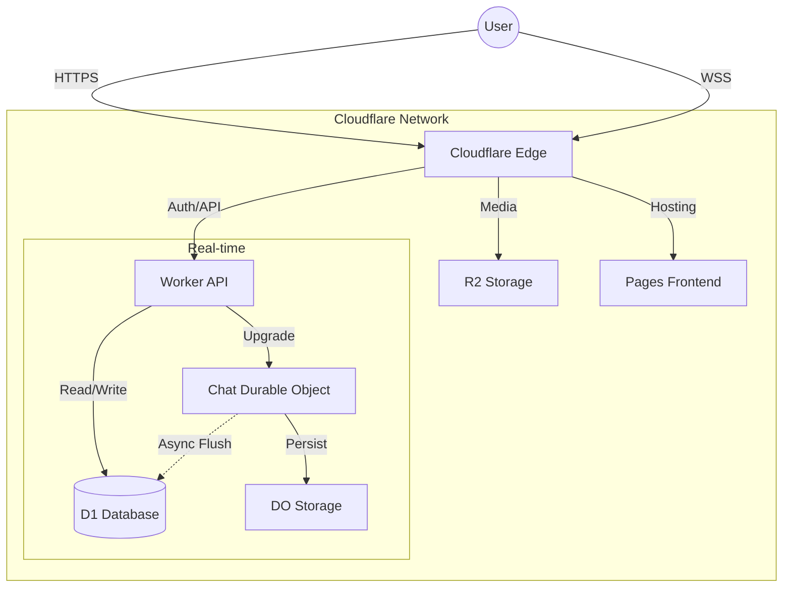

# Love Vibes - System Architecture

> **Architecture Style:** Edge-Native Monolith  
> **Primary Cloud:** Cloudflare (Workers, D1, R2, Durable Objects)

---

## 1. High-Level Overview

Love Vibes is designed as a privacy-first, edge-native dating platform. Unlike traditional centralized architectures (AWS/GCP), it leverages Cloudflare's global edge network to process requests close to the user, ensuring low latency and high scalability.

### Core Components

| Component | Technology | Purpose |
|-----------|------------|---------|
| **API Layer** | Cloudflare Workers | Serverless request handling, auth, business logic |
| **Real-time** | Durable Objects | WebSocket chat rooms, presence, stateful coordination |
| **Database** | D1 (SQLite) | Relational user data, matches, transactions |
| **Storage** | R2 (Object Storage) | User photos, media assets |
| **Frontend** | Next.js (SSG/SPA) | Hosted on Cloudflare Pages |
| **Mobile** | Capacitor | Native shell for iOS/Android |

---

## 2. Data Flow

### 2.1 User Request (HTTP)
1. **Client** (App/Web) sends request to `api.lovevibes.app`
2. **Cloudflare WAF** filters malicious traffic
3. **Worker** routes request based on path (`/v2/auth`, `/v2/feed`)
4. **Auth Middleware** verifies JWT via `checkAuth`
5. **Handler** executes logic (queries D1, checks R2)
6. **Response** sent back to user (JSON)

### 2.2 detailed Chat Flow (WebSocket)
1. **Client** connects to `wss://api.lovevibes.app/ws/chat`
2. **Worker** upgrades connection to WebSocket
3. **Durable Object** (`ChatRoom`) accepts connection
4. **State** (messages) stored in DO storage (fast access) & flushed to D1 (persistence)
5. **Real-time** messages broadcast to connected peer

---

## 3. Edge Strategy

We choose **Edge-Native** for specific reasons:

1. **Latency:** Matching and chat happen ms away from users.
2. **Cost:** Significantly lower than AWS EC2/RDS.
3. **Simplicity:** No VPCs, subnets, or load balancers to manage.

### Durable Objects Usage
- **ChatRoom:** One DO per match. Handles message routing and storage.
- **MatchLobby:** (Future) Coordination for real-time vibe checks.

---

## 4. Frontend Architecture

- **Framework:** Next.js (App Router)
- **Deployment:** Static Export (`output: 'export'`) to Cloudflare Pages
- **State Management:** React Context (UserContext, WebSocketContext)
- **Styling:** Tailwind CSS + Shadcn/UI
- **PWA:** Fully installable PWA capabilities

---

## 5. Security Architecture

See [Security Documentation](./security.md) for details on:
- JWT Authentication
- Passkey (WebAuthn) integration
- Rate Limiting strategies
- Content Moderation (AI-based)
